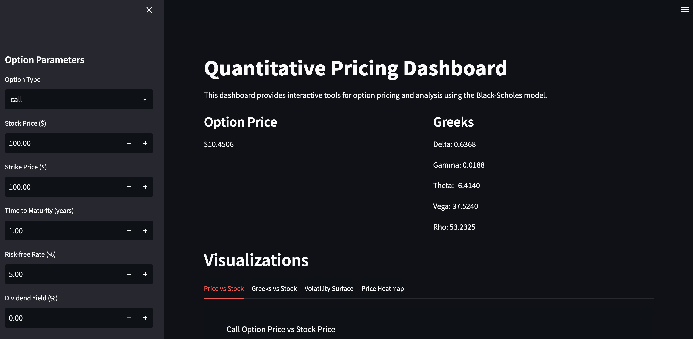
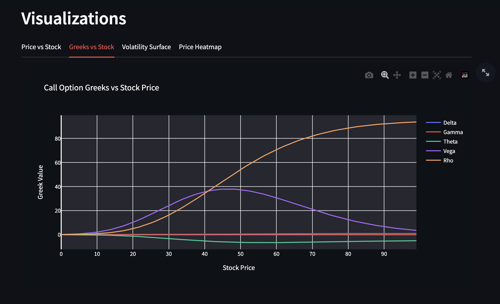
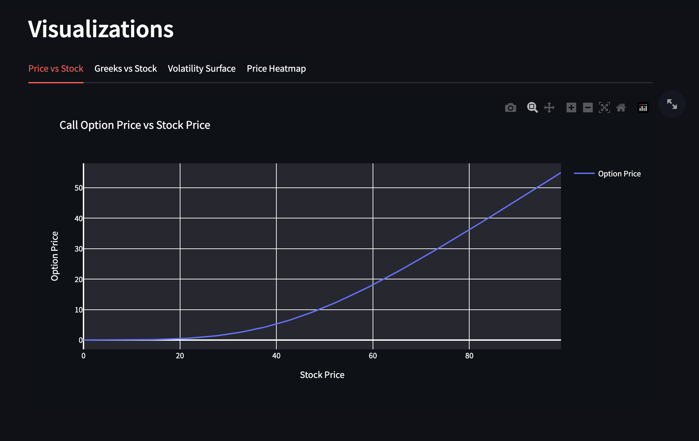

# QuantLab Pricing Engine

A Python-based quantitative pricing application for financial derivatives featuring Black–Scholes option pricing, Greeks calculations, and an interactive Streamlit dashboard for visualization and experimentation.

## Features

- Black–Scholes option pricing implementation
- Greeks calculations: Delta, Gamma, Theta, Vega, and Rho
- Interactive dashboard built with Streamlit
- Financial visualizations using Plotly and Matplotlib
- Volatility surface visualization
- Option price heatmaps
- Price and Greeks sensitivity analysis
- Modular and extensible project architecture
- Unit tests using pytest

## Demo

Example screenshots of the application interface are available in the `demo/` folder.

```
demo/
├── ss1.png
├── ss2.png
└── ss3.png
```

You can also embed the screenshots in the README:





## Project Structure

```
QuantPricing/
│
├── app/                     # Core pricing logic
│   ├── black_scholes.py     # Black–Scholes pricing implementation
│   ├── greeks.py            # Greeks calculations
│   ├── utils.py             # Utility and validation functions
│   ├── visualizations.py    # Financial visualization functions
│   └── config.py            # Default model parameters
│
├── dashboard/               # Streamlit dashboard
│   └── streamlit_app.py
│
├── tests/                   # Unit tests
│   ├── test_black_scholes.py
│   ├── test_greeks.py
│   └── test_utils.py
│
├── demo/                    # Application screenshots
│
├── requirements.txt
└── run_app.sh               # Script to launch dashboard
```

## Setup

### 1. Create a virtual environment

```bash
python -m venv venv
```

Activate it:

Mac / Linux

```bash
source venv/bin/activate
```

Windows

```bash
venv\Scripts\activate
```

### 2. Install dependencies

```bash
pip install -r requirements.txt
```

### 3. Run the application

```bash
./run_app.sh
```

or run Streamlit directly

```bash
streamlit run dashboard/streamlit_app.py
```

## Usage

The application allows users to:

- Calculate option prices using the Black–Scholes model
- Compute Greeks for call and put options
- Visualize option price sensitivity to stock price
- Explore Greeks behavior across price ranges
- Generate volatility surface visualizations
- View option price heatmaps
- Interactively adjust model parameters in the dashboard

## Testing

Run the test suite with:

```bash
pytest tests/
```

Tests cover:

- Black–Scholes pricing functions
- Greeks calculations
- Utility functions

## Technologies Used

- Python
- NumPy
- SciPy
- Plotly
- Matplotlib
- Streamlit
- Pytest

## License

This project is intended for educational and research purposes in quantitative finance.
